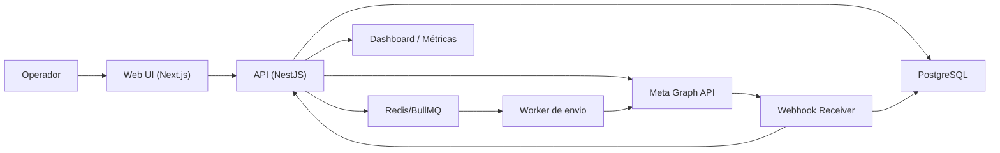

# Campaign Sender self-hosted para WhatsApp Business Platform

Validação técnica baseada nos materiais oficiais da Meta consultados em 2026-03-24.

## 0. Status implementado em produção

Estado validado em `2026-04-02`:

- frontend publicado em `https://waba.collos.com.br`
- API publicada em `https://waba-api.collos.com.br/api`
- deploy por `docker compose` em VPS Oracle no path `/opt/apps/waba`
- `PostgreSQL` como persistência operacional principal para:
  - integrações
  - templates
  - flows
  - campanhas
  - `campaign_messages`
  - `message_events`
  - `flow_responses`
  - `audit_logs`
  - `opt_outs`
- `app_state` mantido apenas como estado agregado compacto
- `SQLite` ainda presente no código como compatibilidade/legado, mas não deve ser usado como store primária de produção

Incidente de produção corrigido em `2026-04-02`:

- sintoma: `Failed to fetch` no frontend e erros aparentes de CORS
- causa real: `502` upstream por pressão do backend ao regravar estado operacional muito grande
- correção aplicada: mover hot paths operacionais para tabelas Postgres dedicadas e reduzir pressão de polling no frontend

## 1. Visão geral da solução

Objetivo: operar campanhas de WhatsApp com `templates` e `flows` aprovados, sem Twilio/n8n/BSP intermediário, usando apenas Graph API + Webhooks oficiais da Meta.

Escopo operacional do MVP:

- importar contatos e listas via CSV
- sincronizar `templates` aprovados da WABA
- sincronizar `flows` existentes e seus metadados
- criar campanha guiada sem payload manual
- enviar em lote com limites, retries e auditoria
- acompanhar `accepted`, `sent`, `delivered`, `read`, `failed`
- bloquear envio para contatos com opt-out
- registrar trilha completa de quem enviou, o que foi enviado e o resultado

Decisão principal:

- usar `template messages` como mecanismo padrão de campanha
- usar `Flow` em campanha por meio de template aprovado com botão `FLOW`
- suportar envio direto de `interactive flow` apenas como modo opcional dentro da janela de 24 horas, não como caminho principal de campanha anual

Motivo: campanhas anuais normalmente são `business-initiated`; fora da janela de 24 horas o envio precisa ser feito com template aprovado.

## 2. Arquitetura e stack recomendadas

### Stack recomendada

Recomendação:

- frontend: `Next.js 15` + `React` + `TypeScript`
- backend API: `NestJS` + `TypeScript`
- banco: `PostgreSQL 16`
- filas e rate limit: `Redis 7` + `BullMQ`
- autenticação interna: `NextAuth` ou autenticação própria via sessão segura
- storage opcional para arquivos importados e exports: `S3-compatible` ou volume local
- reverse proxy/TLS: `Caddy`
- observabilidade mínima: logs JSON em stdout + dashboard interno + endpoint `/metrics`

Por que essa stack:

- TypeScript ponta a ponta reduz fricção para 1-2 devs
- NestJS organiza bem integrações externas, workers e webhooks
- BullMQ resolve fila, reprocessamento, atraso e deduplicação com pouca complexidade
- PostgreSQL cobre bem auditoria, relatórios simples e rastreabilidade

Observação:

- a produção atual ainda não usa `Redis/BullMQ`
- o dispatcher segue inline e single-process
- isso atende o hotfix atual, mas não é o estado final desejado para escala

### Componentes



### Fluxo macro

1. operador importa contatos e cria listas
2. backend normaliza, deduplica e marca contatos inválidos
3. job de sincronização carrega `templates` e `flows` da Meta
4. operador cria campanha escolhendo template ou template+flow
5. backend gera `campaign_messages` e enfileira jobs
6. worker consome fila respeitando throughput e pair limits
7. Meta responde `accepted` no envio e passa a publicar status por webhook
8. webhook receiver persiste eventos e atualiza estado agregado
9. dashboard mostra progresso, falhas, métricas e opção de reenvio

### Módulos internos

- `auth`: login, RBAC, sessões
- `integrations`: credenciais Meta, teste de conexão, sync de assets
- `contacts`: contatos, listas, importações, exclusões, opt-out
- `library`: templates, flows, previews, cache
- `campaigns`: criação, validação, scheduling, execução
- `dispatch`: fila, rate limiting, retries, idempotência
- `webhooks`: verificação Meta, status, inbound, opt-out, auditoria
- `reporting`: métricas, exportações, trilha de auditoria

Desvio atual entre spec e produção:

- `dispatch` ainda não está em fila externa
- `webhooks` ainda precisam validar `X-Hub-Signature-256`
- existe compatibilidade residual com `SQLite`

## 3. Fluxo de telas

### 3.1 Login

- email/senha ou SSO interno
- papéis: `admin`, `operator`, `viewer`

### 3.2 Integrações

Wireframe textual:

```text
[Conta Meta]
- Nome da integração
- Graph API Version
- WABA ID
- Phone Number ID
- Access Token (oculto)
- Verify Token do webhook
- App Secret / assinatura (opcional para validação)

[Ações]
- Testar conexão
- Sincronizar templates
- Sincronizar flows
- Ver último sync
- Ver throughput atual do número
```

### 3.3 Contatos e listas

```text
[Contatos]
- busca por nome, telefone, tag, status
- indicadores: válido, inválido, opt-out, bloqueado, duplicado

[Importar CSV]
- upload do arquivo
- mapear colunas: nome, telefone, email, tags, atributos extras
- preview de normalização E.164
- preview de duplicatas
- confirmar importação

[Listas]
- criar lista
- adicionar/remover contatos
- ver contagem elegível
```

### 3.4 Biblioteca

```text
[Templates]
- nome
- idioma
- categoria
- status
- tipo de componentes
- preview renderizado
- variáveis detectadas
- se contém botão FLOW

[Flows]
- nome
- status
- categorias
- versão JSON
- preview_url
- health_status
- endpoint_uri/data_channel_uri
```

### 3.5 Criar campanha

Wizard recomendado:

1. escolher tipo
- template
- template com flow

2. escolher asset
- template aprovado
- se template com flow, validar que o template contém botão `FLOW`

3. escolher lista
- mostrar total importado
- total elegível
- total bloqueado por opt-out
- total inválido

4. mapear variáveis
- UI detecta placeholders do template
- operador escolhe origem de cada variável:
  - valor fixo
  - coluna do CSV
  - atributo do contato
  - valor gerado pelo sistema

5. revisão
- preview por contato de exemplo
- throughput configurado
- agendar ou enviar agora
- checkbox de confirmação

6. execução
- barra de progresso
- taxa por segundo
- contadores por status
- tabela de erros

### 3.6 Monitoramento

```text
[Campanha]
- rascunho / validando / enfileirada / em envio / concluída / pausada / cancelada
- total
- aceitas
- enviadas
- entregues
- lidas
- falhas
- opt-out durante campanha

[Ações]
- pausar
- retomar
- reprocessar falhas transitórias
- exportar resultado
```

## 4. Integração com APIs oficiais

### 4.1 Conceitos mínimos

- `WABA`: conta de negócio do WhatsApp
- `phone_number_id`: identificador do número remetente usado em `/messages`
- `message_templates`: templates aprovados para mensagens iniciadas pela empresa
- `flows`: experiências estruturadas do WhatsApp
- `webhooks`: notificações assíncronas de mensagens recebidas e status

### 4.2 Permissões e credenciais

Necessárias:

- `whatsapp_business_management`
- `whatsapp_business_messaging`
- `business_management` apenas se precisar operar recursos do business portfolio além do básico

Recomendação:

- usar `System User Access Token`
- guardar token criptografado no banco ou em secret store
- nunca expor token ao frontend

### 4.3 Descoberta de recursos

#### Ler WABA e phone numbers

```http
GET /{WABA_ID}
GET /{WABA_ID}/phone_numbers
GET /{PHONE_NUMBER_ID}?fields=throughput
```

Uso:

- verificar conexão
- exibir número ativo
- obter throughput atual

#### Listar templates

Endpoint oficial:

```http
GET /{WABA_ID}/message_templates
```

Estratégia de sync:

1. paginar todos os templates da WABA
2. filtrar e cachear localmente apenas `status = APPROVED` para uso operacional
3. enriquecer preview/variáveis pelos `components` retornados

Exemplo de chamada:

```bash
curl --request GET \
  "https://graph.facebook.com/v23.0/${WABA_ID}/message_templates?limit=100" \
  -H "Authorization: Bearer ${META_TOKEN}"
```

Observação:

- o uso de `fields=...` segue o padrão Graph API; caso queira máxima compatibilidade, consuma primeiro os campos padrão do edge e, para detalhes adicionais, consulte template por ID

#### Listar flows

Endpoint oficial:

```http
GET /{WABA_ID}/flows
```

Depois, enriquecer por flow:

```http
GET /{FLOW_ID}?fields=id,name,categories,preview,status,validation_errors,json_version,data_api_version,data_channel_uri,health_status,whatsapp_business_account,application
GET /{FLOW_ID}/assets
```

Uso do `assets`:

- obter URL do `FLOW_JSON`
- versionar internamente o snapshot usado na campanha

### 4.4 Regras operacionais de envio

Regra principal:

- fora da janela de 24 horas: usar template aprovado
- dentro da janela de 24 horas: pode usar mensagem livre ou `interactive flow`

Implica para o produto:

- o wizard deve mostrar claramente se a campanha é `template-only`, `template+flow` ou `session flow`
- para campanha anual de pesquisa, o caminho padrão deve ser `template+flow`

### 4.5 Enviar template

Endpoint oficial:

```http
POST /{PHONE_NUMBER_ID}/messages
```

Exemplo de payload para template textual:

```json
{
  "messaging_product": "whatsapp",
  "to": "5511999999999",
  "type": "template",
  "template": {
    "name": "pesquisa_satisfacao_anual",
    "language": {
      "code": "pt_BR"
    },
    "components": [
      {
        "type": "body",
        "parameters": [
          { "type": "text", "text": "Maria" },
          { "type": "text", "text": "Clínica Exemplo" }
        ]
      }
    ]
  }
}
```

Resposta síncrona esperada:

```json
{
  "messaging_product": "whatsapp",
  "contacts": [{ "input": "5511999999999", "wa_id": "5511999999999" }],
  "messages": [{ "id": "wamid.HBg..." }]
}
```

### 4.6 Criar ou usar template com botão FLOW

Para disparo `business-initiated` com Flow, o template aprovado precisa conter botão `FLOW`.

Criação do template com flow:

```http
POST /{WABA_ID}/message_templates
```

Exemplo oficial de criação:

```json
{
  "name": "pesquisa_flow_anual",
  "language": "pt_BR",
  "category": "MARKETING",
  "components": [
    {
      "type": "body",
      "text": "Queremos ouvir você."
    },
    {
      "type": "BUTTONS",
      "buttons": [
        {
          "type": "FLOW",
          "text": "Responder pesquisa",
          "flow_name": "pesquisa_satisfacao_2026",
          "navigate_screen": "START",
          "flow_action": "navigate"
        }
      ]
    }
  ]
}
```

Na aplicação:

- o operador nunca monta isso manualmente
- a UI apenas mostra templates já aprovados e marca quais possuem botão `FLOW`

Envio do template com flow:

- o envio continua usando `POST /{PHONE_NUMBER_ID}/messages` com `type=template`
- o payload exato de componentes em runtime depende da estrutura aprovada do template
- a aplicação deve ler `components` do template sincronizado e montar automaticamente os parâmetros exigidos

Exemplo de montagem interna, como pseudocódigo:

```ts
const payload = {
  messaging_product: 'whatsapp',
  to: contact.phoneE164,
  type: 'template',
  template: {
    name: template.name,
    language: { code: template.language },
    components: buildTemplateRuntimeComponents({
      templateComponents: template.components,
      contact,
      campaign,
      flowToken: generateFlowToken(campaign.id, contact.id),
    }),
  },
};
```

Observação importante:

- o `flow_token` deve ser gerado pela aplicação e persistido para correlação posterior
- se o template aprovado não exigir parâmetros dinâmicos no botão, o `flow_token` pode ser mantido apenas no contexto da campanha; se exigir, a montagem deve injetá-lo no componente do botão

### 4.7 Enviar flow interativo diretamente

Modo opcional, útil somente em conversa aberta.

Endpoint oficial:

```http
POST /{PHONE_NUMBER_ID}/messages
```

Payload:

```json
{
  "messaging_product": "whatsapp",
  "recipient_type": "individual",
  "to": "5511999999999",
  "type": "interactive",
  "interactive": {
    "type": "flow",
    "header": {
      "type": "text",
      "text": "Pesquisa"
    },
    "body": {
      "text": "Responda em menos de 1 minuto."
    },
    "footer": {
      "text": "Sua opinião é importante."
    },
    "action": {
      "name": "flow",
      "parameters": {
        "mode": "published",
        "flow_message_version": "3",
        "flow_token": "cmp_123_ctt_456",
        "flow_id": "123456789012345",
        "flow_cta": "Responder",
        "flow_action": "navigate",
        "flow_action_payload": {
          "screen": "START",
          "data": {
            "contact_id": "456",
            "campaign_id": "123"
          }
        }
      }
    }
  }
}
```

Esse modo não deve ser a rota padrão da UI para campanhas anuais.

### 4.8 Webhooks

Configuração:

1. configurar endpoint HTTPS público no app da Meta
2. implementar verificação `hub.challenge`
3. assinar a app à WABA:

```http
POST /{WABA_ID}/subscribed_apps
```

Opcional para multi-WABA com callback distinto:

```http
POST /{WABA_ID}/subscribed_apps
{
  "override_callback_uri": "https://wa.example.com/webhooks/meta/whatsapp",
  "verify_token": "segredo-verificacao"
}
```

Webhook GET de verificação:

```ts
GET /webhooks/meta/whatsapp

if (
  req.query['hub.mode'] === 'subscribe' &&
  req.query['hub.verify_token'] === config.meta.verifyToken
) {
  return res.status(200).send(req.query['hub.challenge']);
}

return res.sendStatus(403);
```

Webhook POST:

- responder `200 OK` imediatamente
- persistir payload bruto
- enviar para processamento assíncrono

Exemplo de envelope:

```json
{
  "object": "whatsapp_business_account",
  "entry": [
    {
      "id": "WABA_ID",
      "changes": [
        {
          "field": "messages",
          "value": {
            "messaging_product": "whatsapp",
            "metadata": {
              "display_phone_number": "551199999999",
              "phone_number_id": "1234567890"
            }
          }
        }
      ]
    }
  ]
}
```

### 4.9 Status e atualização de mensagens

Status de interesse:

- `sent`
- `delivered`
- `read`
- `failed`

Regras:

- `accepted` é estado interno da aplicação, derivado da resposta síncrona da API
- `sent/delivered/read/failed` vêm do webhook da Meta
- `failed` deve persistir `errors[]` integralmente

Processamento:

1. localizar `campaign_message` por `provider_message_id`
2. inserir evento em `message_events`
3. atualizar estado agregado do `campaign_message`
4. recomputar contadores da campanha

## 5. Modelo de dados

Sugestão em PostgreSQL.

### users

- `id`
- `email`
- `name`
- `password_hash` ou `sso_subject`
- `role` enum(`admin`,`operator`,`viewer`)
- `created_at`
- `updated_at`

### integrations

- `id`
- `name`
- `graph_api_version`
- `waba_id`
- `phone_number_id`
- `business_account_id` nullable
- `access_token_ciphertext`
- `verify_token_ciphertext`
- `app_secret_ciphertext` nullable
- `webhook_callback_url`
- `status`
- `last_sync_at`
- `last_healthcheck_at`
- `created_by_user_id`
- `created_at`
- `updated_at`

### contacts

- `id`
- `external_ref` nullable
- `name`
- `phone_raw`
- `phone_e164`
- `phone_hash`
- `email` nullable
- `attributes_jsonb`
- `is_valid`
- `validation_error` nullable
- `is_opted_out`
- `opted_out_at` nullable
- `opt_out_source` nullable
- `created_at`
- `updated_at`

Índices:

- unique em `phone_e164`
- índice em `is_opted_out`

### lists

- `id`
- `name`
- `description`
- `source_type` enum(`csv`,`manual`,`api`)
- `source_file_path` nullable
- `created_by_user_id`
- `created_at`

### list_members

- `list_id`
- `contact_id`
- `created_at`

Índice:

- unique em `(list_id, contact_id)`

### imports

- `id`
- `list_id`
- `file_name`
- `file_sha256`
- `total_rows`
- `valid_rows`
- `invalid_rows`
- `duplicate_rows`
- `status`
- `created_by_user_id`
- `created_at`

### templates_cache

- `id`
- `integration_id`
- `meta_template_id`
- `name`
- `language_code`
- `category`
- `status`
- `components_jsonb`
- `has_flow_button`
- `flow_button_meta_jsonb` nullable
- `quality_score_jsonb` nullable
- `last_synced_at`
- `raw_jsonb`

Índices:

- unique em `(integration_id, meta_template_id)`
- índice em `(integration_id, status)`

### flows_cache

- `id`
- `integration_id`
- `meta_flow_id`
- `name`
- `categories_jsonb`
- `status`
- `json_version`
- `data_api_version`
- `preview_url` nullable
- `preview_expires_at` nullable
- `health_status_jsonb`
- `endpoint_uri` nullable
- `assets_jsonb`
- `raw_jsonb`
- `last_synced_at`

Índices:

- unique em `(integration_id, meta_flow_id)`

### campaigns

- `id`
- `integration_id`
- `created_by_user_id`
- `name`
- `channel` default `whatsapp`
- `mode` enum(`template`,`template_flow`,`session_flow`)
- `template_cache_id` nullable
- `flow_cache_id` nullable
- `list_id`
- `parameter_mapping_jsonb`
- `filter_snapshot_jsonb`
- `scheduled_at` nullable
- `started_at` nullable
- `finished_at` nullable
- `status` enum(`draft`,`scheduled`,`queued`,`sending`,`paused`,`completed`,`cancelled`,`failed`)
- `send_rate_mps`
- `dry_run`
- `summary_jsonb`
- `created_at`
- `updated_at`

### campaign_messages

- `id`
- `campaign_id`
- `contact_id`
- `phone_e164`
- `status` enum(`pending`,`queued`,`accepted`,`sent`,`delivered`,`read`,`failed`,`skipped`,`cancelled`)
- `skip_reason` nullable
- `payload_jsonb`
- `payload_hash`
- `flow_token` nullable
- `provider_message_id` nullable
- `provider_conversation_id` nullable
- `provider_error_code` nullable
- `provider_error_title` nullable
- `provider_error_message` nullable
- `attempt_count`
- `next_attempt_at` nullable
- `last_attempt_at` nullable
- `sent_at` nullable
- `delivered_at` nullable
- `read_at` nullable
- `failed_at` nullable
- `created_at`
- `updated_at`

Índices:

- unique em `(campaign_id, contact_id)`
- unique parcial em `provider_message_id`
- índice em `(campaign_id, status)`
- índice em `next_attempt_at`

### message_events

- `id`
- `campaign_message_id` nullable
- `provider_message_id` nullable
- `event_type`
- `status`
- `payload_jsonb`
- `occurred_at`
- `received_at`

Índices:

- índice em `provider_message_id`
- índice em `occurred_at`

### opt_outs

- `id`
- `contact_id`
- `source` enum(`inbound_keyword`,`manual`,`import`,`api`)
- `keyword` nullable
- `message_id` nullable
- `notes` nullable
- `created_by_user_id` nullable
- `created_at`

### audit_logs

- `id`
- `actor_user_id` nullable
- `action`
- `entity_type`
- `entity_id`
- `request_id`
- `ip_address`
- `metadata_jsonb`
- `created_at`

## 6. Estratégia de filas, rate limit, retries e idempotência

### 6.1 Fila

Filas BullMQ:

- `campaign.prepare`
- `campaign.dispatch`
- `campaign.retry`
- `meta.webhook.process`
- `meta.sync.templates`
- `meta.sync.flows`

### 6.2 Rate limit

Implementação:

- token bucket por `phone_number_id`
- configuração por integração: `send_rate_mps`
- default operacional seguro: `20 mps`
- teto configurável até o throughput efetivo do número

Regras extras:

- limite por par número-destinatário: tratar `131056`
- para campanhas em massa com destinatários únicos, pair limit raramente é gargalo
- para reenvio rápido ao mesmo contato, aplicar cooldown por contato

### 6.3 Retries

Erros transitórios:

- `130429` throughput excedido
- `131056` pair rate limit
- `5xx`
- timeout de rede
- indisponibilidade temporária da Meta

Política:

- tentativa 1: imediata
- tentativa 2: `+30s`
- tentativa 3: `+2min`
- tentativa 4: `+10min`
- tentativa 5: `+1h`
- depois marcar `failed`

Backoff especial:

- `130429`: reduzir temporariamente o throughput global da campanha
- `131056`: agendar retry apenas para aquele contato

Erros permanentes:

- número inválido
- template inexistente ou não aprovado
- contato com opt-out
- falha de permissão/autorização
- bloqueio por política que exija intervenção humana

Nesses casos:

- não repetir automaticamente
- registrar motivo final

### 6.4 Idempotência

Camadas:

1. unique `(campaign_id, contact_id)` em `campaign_messages`
2. `jobId = campaign:{campaignId}:contact:{contactId}` na fila
3. `payload_hash` para detectar mutação indevida
4. unique em `provider_message_id` ao reconciliar webhook

Regra prática:

- clicar duas vezes em `Enviar` não pode duplicar mensagem
- reprocessar falhas só deve atuar sobre mensagens `failed` elegíveis

## 7. Webhooks: setup e processamento

### 7.1 Contrato interno

Endpoints:

```http
GET  /webhooks/meta/whatsapp
POST /webhooks/meta/whatsapp
```

Fluxo:

1. receber POST
2. gerar `request_id`
3. gravar payload bruto em tabela ou storage de eventos
4. responder `200` em menos de `250 ms` medianamente
5. enfileirar parsing

### 7.2 Parsing

Extrair:

- `phone_number_id`
- `statuses[]`
- `messages[]`
- `contacts[]`
- `errors[]`

Processadores:

- `status processor`: atualiza `campaign_messages`
- `inbound processor`: cria evento inbound e detecta opt-out
- `audit processor`: trilha de recebimento

### 7.3 Opt-out automático

Palavras-chave sugeridas:

- `PARAR`
- `SAIR`
- `STOP`
- `CANCELAR`
- `REMOVER`

Regra:

- se inbound text normalizado bater com lista de opt-out, marcar contato como `is_opted_out = true`
- adicionar registro em `opt_outs`
- impedir novos envios

### 7.4 Reentrega da Meta

A Meta pode reenviar webhook com backoff por até 7 dias.

Logo:

- o processamento precisa ser idempotente
- `message_events` deve aceitar dedupe por assinatura funcional do evento

Exemplo:

```ts
const dedupeKey = sha256(
  JSON.stringify({
    provider_message_id,
    status,
    timestamp,
    recipient_id,
  }),
);
```

## 8. Segurança, LGPD e auditoria

### Segurança

- tokens e segredos criptografados em repouso
- segredo mestre via variável de ambiente ou secret store
- RBAC básico
- sessão HTTP-only
- CSRF nas rotas de UI
- rate limit em login e endpoints críticos
- logs sem token e sem payload sensível completo por padrão

### LGPD

Mínimos necessários:

- base legal documentada fora do sistema
- registro de origem do contato
- opt-out simples e efetivo
- retenção configurável
- anonimização/exclusão sob demanda

Recomendação prática:

- manter `message_events.payload_jsonb` por 90-180 dias
- manter `audit_logs` por 12-24 meses
- anonimizar PII após prazo operacional, preservando métricas agregadas

### Auditoria

Registrar:

- quem criou campanha
- quem alterou parâmetros
- quando iniciou
- lista usada
- template/flow usado
- taxa configurada
- total elegível, bloqueado e enviado
- falhas e reprocessamentos

## 9. Endpoints internos da aplicação

### Auth e config

```http
POST /api/auth/login
POST /api/auth/logout
GET  /api/me
GET  /api/integrations
POST /api/integrations
POST /api/integrations/:id/test
POST /api/integrations/:id/sync/templates
POST /api/integrations/:id/sync/flows
GET  /api/integrations/:id/health
```

### Contatos e listas

```http
GET  /api/contacts
POST /api/contacts/imports/csv
GET  /api/contacts/imports/:id
POST /api/lists
GET  /api/lists
GET  /api/lists/:id
POST /api/lists/:id/members
DELETE /api/lists/:id/members/:contactId
POST /api/contacts/:id/opt-out
POST /api/contacts/:id/opt-in
```

### Biblioteca

```http
GET /api/library/templates
GET /api/library/templates/:id
GET /api/library/flows
GET /api/library/flows/:id
```

### Campanhas

```http
POST /api/campaigns
GET  /api/campaigns
GET  /api/campaigns/:id
POST /api/campaigns/:id/validate
POST /api/campaigns/:id/start
POST /api/campaigns/:id/pause
POST /api/campaigns/:id/resume
POST /api/campaigns/:id/retry-failed
GET  /api/campaigns/:id/messages
GET  /api/campaigns/:id/export
```

### Métricas

```http
GET /api/dashboard/summary
GET /api/dashboard/campaigns/:id/metrics
GET /metrics
```

## 10. Pseudocódigo essencial

### 10.1 Preparação da campanha

```ts
async function prepareCampaign(campaignId: string) {
  const campaign = await campaignsRepo.get(campaignId);
  const contacts = await contactsRepo.getEligibleContacts(campaign.listId);

  for (const contact of contacts) {
    if (contact.isOptedOut || !contact.isValid) {
      await campaignMessagesRepo.insertSkipped(campaign, contact);
      continue;
    }

    const payload = payloadBuilder.build(campaign, contact);

    await campaignMessagesRepo.insertPending({
      campaignId,
      contactId: contact.id,
      phoneE164: contact.phoneE164,
      payload,
      payloadHash: sha256(JSON.stringify(payload)),
      flowToken: payload.meta?.flowToken ?? null,
    });

    await dispatchQueue.add(
      `campaign:${campaignId}:contact:${contact.id}`,
      { campaignId, contactId: contact.id },
      { jobId: `campaign:${campaignId}:contact:${contact.id}` },
    );
  }
}
```

### 10.2 Worker de envio

```ts
async function sendCampaignMessage(job: DispatchJob) {
  const row = await campaignMessagesRepo.lock(job.campaignId, job.contactId);

  if (!row || !['pending', 'failed', 'queued'].includes(row.status)) return;
  if (await contactCooldownActive(row.contactId)) throw new PairRateLimitLocalError();

  await rateLimiter.consume(row.integrationPhoneNumberId);

  try {
    const response = await metaClient.sendMessage(row.payload);

    await campaignMessagesRepo.markAccepted({
      id: row.id,
      providerMessageId: response.messages[0].id,
      lastAttemptAt: new Date(),
    });
  } catch (error) {
    const decision = classifyMetaError(error);

    if (decision.retryable) {
      await campaignMessagesRepo.scheduleRetry(row.id, decision.nextAttemptAt, error);
      throw error;
    }

    await campaignMessagesRepo.markFailedFinal(row.id, error);
  }
}
```

### 10.3 Webhook de status

```ts
async function processStatusWebhook(payload: MetaWebhookPayload) {
  for (const status of extractStatuses(payload)) {
    const message = await campaignMessagesRepo.findByProviderMessageId(status.id);
    if (!message) continue;

    const alreadySeen = await eventsRepo.exists({
      providerMessageId: status.id,
      status: status.status,
      timestamp: status.timestamp,
    });
    if (alreadySeen) continue;

    await eventsRepo.insert({
      campaignMessageId: message.id,
      providerMessageId: status.id,
      eventType: 'meta_status',
      status: status.status,
      payload,
      occurredAt: new Date(Number(status.timestamp) * 1000),
    });

    await campaignMessagesRepo.applyStatus(message.id, status);
    await campaignsRepo.refreshCounters(message.campaignId);
  }
}
```

## 11. Docker Compose sugerido

`docker-compose.yml` de alto nível:

```yaml
services:
  web:
    image: campaign-sender-web:latest
    depends_on:
      - api
    environment:
      NEXT_PUBLIC_API_BASE_URL: http://api:3001

  api:
    image: campaign-sender-api:latest
    depends_on:
      - db
      - redis
    env_file:
      - .env

  worker:
    image: campaign-sender-api:latest
    command: ["node", "dist/apps/worker/main.js"]
    depends_on:
      - db
      - redis
    env_file:
      - .env

  db:
    image: postgres:16
    environment:
      POSTGRES_DB: campaign_sender
      POSTGRES_USER: app
      POSTGRES_PASSWORD: strong-password
    volumes:
      - postgres_data:/var/lib/postgresql/data

  redis:
    image: redis:7
    command: ["redis-server", "--appendonly", "yes"]
    volumes:
      - redis_data:/data

  caddy:
    image: caddy:2
    ports:
      - "80:80"
      - "443:443"
    depends_on:
      - web
      - api

volumes:
  postgres_data:
  redis_data:
```

### Variáveis de ambiente sugeridas

```bash
NODE_ENV=production
APP_BASE_URL=https://campaign.example.com
WEBHOOK_BASE_URL=https://campaign.example.com

DATABASE_URL=postgresql://app:strong-password@db:5432/campaign_sender
REDIS_URL=redis://redis:6379

APP_ENCRYPTION_KEY=base64-or-hex-key
SESSION_SECRET=long-random-secret

META_GRAPH_API_BASE=https://graph.facebook.com
META_GRAPH_API_VERSION=v23.0
META_WABA_ID=123456789
META_PHONE_NUMBER_ID=987654321
META_ACCESS_TOKEN=replace-me
META_VERIFY_TOKEN=replace-me
META_APP_SECRET=replace-me-if-used

DEFAULT_SEND_RATE_MPS=20
MAX_RETRY_ATTEMPTS=5
OPT_OUT_KEYWORDS=PARAR,SAIR,STOP,CANCELAR,REMOVER

LOG_LEVEL=info
```

### Kubernetes

Opcional depois do MVP. Só vale a pena se houver:

- múltiplos números/WABAs
- necessidade de HA real
- observabilidade centralizada já madura

Para início, `docker compose` é suficiente.

## 12. Checklist de implantação

### Infra

- domínio público configurado
- HTTPS funcional
- backup de PostgreSQL
- persistência do Redis ou política de reconstrução aceitável
- rotação de logs

### Meta

- app em modo adequado para produção
- webhook configurado e verificado
- app assinada à WABA via `/{WABA_ID}/subscribed_apps`
- token com permissões corretas
- templates aprovados
- flow publicado e saudável

### App

- smoke test de sync de templates
- smoke test de sync de flows
- import CSV validado
- envio para lista de teste
- confirmação de webhook `sent/delivered/read/failed`
- validação de opt-out

## 13. Roadmap

### MVP

- integração única com 1 WABA / 1 número
- import CSV
- listas
- sync de templates e flows
- campanha template/template+flow
- fila, retries, dashboard e auditoria

### v2

- agendamento
- segmentação por tags/atributos
- reenvio por regra
- webhooks inbound mais ricos
- templates multi-idioma

### v3

- multi-WABA
- multi-número
- A/B de template
- relatórios avançados
- API externa de ingestão de contatos

## 14. Recomendação objetiva

Para começar sem sobreengenharia:

1. implementar apenas `template` e `template+flow`
2. fixar um `phone_number_id` por instalação no MVP
3. usar `20 mps` como padrão inicial
4. persistir todos os webhooks brutos
5. bloquear imediatamente contatos com opt-out

Isso entrega o caso anual de pesquisa com baixo custo operacional e sem depender de terceiros.

## 15. Fontes oficiais consultadas

- Meta Cloud API overview: https://developers.facebook.com/docs/whatsapp/cloud-api/overview
- Workspace oficial Meta no Postman: https://www.postman.com/meta/workspace/whatsapp-business-platform
- Cloud API collection oficial: https://www.postman.com/meta/workspace/whatsapp-business-platform/documentation/wlk6lh4/whatsapp-cloud-api
- Flows API docs oficiais: https://developers.facebook.com/docs/whatsapp/flows
- List Flows: https://www.postman.com/meta/whatsapp-business-platform/request/7hu6b1x/list-flows
- Get Flow: https://www.postman.com/meta/whatsapp-business-platform/request/b5brcao/get-flow
- List Assets de Flow: https://www.postman.com/meta/whatsapp-business-platform/request/13382743-d87a56fd-736e-4509-a079-33f635c73666
- Get all templates: https://www.postman.com/meta/whatsapp-business-platform/request/13382743-fe7fd515-c860-4e2a-a098-940dbe1fcada
- Subscribe WABA to webhooks: https://www.postman.com/meta/whatsapp-business-platform/request/13382743-3e8909d4-c091-42be-a2a3-e2f4d1a5107f
- Override callback URL: https://www.postman.com/meta/whatsapp-business-platform/request/13382743-b20e1762-e268-498b-882a-a2a55419ee85
